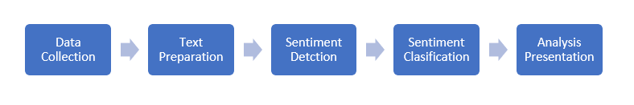

Sentiment Analysis On Product Reviews Using Lexicon Based Model (VADER)
==============================================================

.png);

### The project's objective is to comprehend reviewers' sentiments about a product.


## Sentiment Analysis:

* Sentiment analysis and opinion mining are the computational studies of user opinion to assess the social, psychological, philosophical, and behavioral behaviors and perceptions of a single person or a group of people about a good, service, policy, or certain scenarios. Sentiment analysis is a crucial area of study that helps with product decision-making by revealing people's feelings behind a text.


## Customer Product reviews:
* A customer review is a critique of a good or service written by a consumer who has used it or had some other interaction with it. Customer reviews on e-commerce and online buying platforms are a type of customer feedback. 90% of consumers read product reviews online before making a purchase, and 88% of them believe that product reviews are just as reliable as personal recommendations.


### Dataset
This dataset is having the data of 1K+ Amazon Product's Ratings and Reviews as per their details listed on the official website of Amazon

#### Features

* product_id - Product ID
* product_name - Name of the Product
* category - Category of the Product
* discounted_price - Discounted Price of the Product
* actual_price - Actual Price of the Product
* discount_percentage - Percentage of Discount for the Product
* rating - Rating of the Product
* rating_count - Number of people who voted for the Amazon rating
* about_product - Description about the Product
* user_id - ID of the user who wrote review for the Product
* user_name - Name of the user who wrote review for the Product
* review_id - ID of the user review
* review_title - Short review
* review_content - Long review
* img_link - Image Link of the Product
* product_link - Official Website Link of the Product

* Source: [Data](https://www.kaggle.com/datasets/karkavelrajaj/amazon-sales-dataset)


# Workflow
;


### Steps
1. Load Data
```python
df = read_data_file('../data/raw/amazon.csv', 'csv')
df
```


2. Data Preprocessing and sentiment polarity scores for user reviews on the dataset using a rule-based model
   * Remove Punctuations,special symbols and special characters.

   * Stopword Removal

   * Tokenization

   * Lemmatization

   * VADER
```python
sentiments = sentiment_data(df, 'review_content')
sentiments
```

